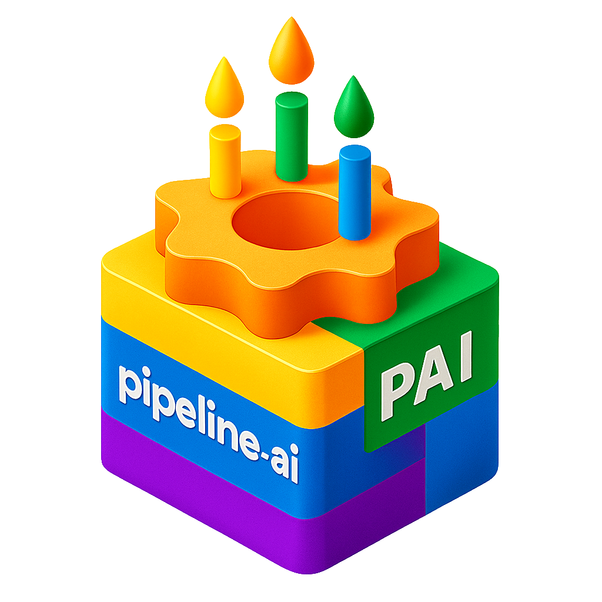

<div align="center">
  
  <h1>PipelineAI (PAI)</h1>
  <p>🧠 Декларативные AI‑сценарии для GitHub Actions и локальной разработки</p>
  <p>🚧 Альфа‑версия. Возможны изменения DSL и API.</p>
</div>

---

## Содержание

- [🚀 Что это и чем полезен](#что-это-и-чем-полезен)
- [📦 Установка](#установка)
- [⚡ Быстрый старт: AI‑ревью в GitHub Actions](#быстрый-старт-ai-ревью-в-github-actions)
  - [2.1. Подключаем workflow](#21-подключаем-workflow)
  - [2.2. Переменные окружения](#22-переменные-окружения)
  - [2.3. Переопределение правил и промптов](#23-переопределение-правил-и-промптов)
  - [2.4. Запуск в PR](#24-запуск-в-pr)
- [📚 Быстрый старт: генерация README в GitHub Actions](#быстрый-старт-генерация-readme-в-github-actions)
- [🧠 Архитектура и ключевые концепции](#архитектура-и-ключевые-концепции)
- [📜 YAML‑DSL: структура сценария](#yaml-dsl-структура-сценария)
  - [4.1. Блок `agent`](#41-блок-agent)
  - [4.2. Блок `defaults`](#42-блок-defaults)
  - [4.3. Функции (`functions`) и инструменты](#43-функции-functions-и-инструменты)
  - [4.4. Шаги (`steps`)](#44-шаги-steps)
- [🔧 Типы шагов](#типы-шагов)
  - [5.1. `shell`](#51-shell)
  - [5.2. `plan`](#52-plan)
    - [5.2.1. Как работает чанкование в `partition`](#521-как-работает-чанкование-в-partition)
  - [5.3. `llm`](#53-llm)
  - [5.4. `matrix` и поэлементный запуск](#54-matrix-и-поэлементный-запуск)
- [🗣️ Промпты для `llm`‑шагов](#промпты-для-llm-шагов)
- [📦 Входы/выходы и артефакты](#входывыходы-и-артефакты)
- [🛡️ Approvers и безопасность инструментов](#approvers-и-безопасность-инструментов)
- [🤖 Пример: сценарий AI‑ревью](#пример-сценарий-ai-ревью)

---

## 🚀 Что это и чем полезен

**PipelineAI (PAI)** — это CLI‑агент на Go, который исполняет сценарии из YAML с помощью LLM и shell‑команд.  
Главная идея: вы декларативно описываете **сценарий работы агента** (шаги, зависимости, инструменты), а рантайм детерминированно исполняет его локально или в CI (например, GitHub Actions).

Почему это удобно:

- **Декларативные сценарии** — сложное поведение агента (ревью, рефакторинг, документация) описывается в YAML в виде инструкций и наборов парамеров.
- **Простое подключение инструментов** — достаточно описать функцию в `functions` с JSON‑схемой параметров и shell‑шаблоном, и LLM сможет её вызывать как `tool`.
- **Чёткий DAG и артефакты** — планировщик строит граф по `needs`, разворачивает `matrix`‑шаги и складывает всё в `.agent/artifacts`. Тем самым можно описывать даже сложные сценарии с множеством зависимостей.
- **CI‑friendly** — сценарии можно запускать в GitHub Actions и локально; есть готовый пример для AI‑ревью pull request’ов и ответов на вопросы с тегом `#ai`.

---

## 📦 Установка

### Go install

```bash
go install github.com/zvuk/pipelineai/cmd/pipelineai@latest
pipelineai --help
```

PAI читает настройки LLM из `.env` (если он есть) и переменных окружения (см. `.tpl.env`):

- `LLM_BASE_URL` — URL OpenAI‑совместимого API (например, `http://localhost:1234/v1` для LM Studio или `http://localhost:8000/v1` для vLLM)
- `LLM_MODEL` — идентификатор модели (в примерах: `openai/gpt-oss-20b`)
- `LLM_API_KEY` — ключ (опционально для локальных рантаймов)
- `LLM_REQUEST_TIMEOUT` — таймаут запроса к LLM

Для локальной сборки из этого репозитория рекомендуется `make build`: цель автоматически подтягивает `libtokenizers.a` и включает exact tokenizer backend (`tokenizers_hf`) для model-specific подсчёта токенов.

Если собирать бинарь напрямую через `go build`/`go install` без тега `tokenizers_hf`, PAI всё равно будет работать, но для неизвестных или неподдержанных exact-backend моделей переключится на byte-based fallback для предрасчётов.

---

## ⚡ Быстрый старт: AI‑ревью в GitHub Actions

Самый простой способ познакомиться с PAI — подключить готовый **reusable workflow** из этого репозитория:  
`.github/workflows/reusable-ai-review.yml` + сценарий `ci/configs/ai-review.yml`.

### 2.1. Подключаем workflow

В репозитории, где нужно AI‑ревью, добавьте workflow, который вызывает reusable workflow PipelineAI:

```yaml
name: AI review (PAI)

on:
  pull_request:
    types: [opened, synchronize, reopened]

permissions:
  contents: read
  pull-requests: write

jobs:
  ai_review:
    uses: zvuk/pipelineai/.github/workflows/reusable-ai-review.yml@main
    with:
      llm_base_url: http://localhost:1234/v1
      llm_model: openai/gpt-oss-20b
      review_parallel: 8
      review_ignore: "**/generated/**,**/mocks/**"
    secrets:
      llm_api_key: ${{ secrets.LLM_API_KEY }}
```

Примечания:

- `llm_api_key` можно не задавать, если ваш LLM не требует ключ.
- Если вы используете `localhost` (LM Studio / vLLM), workflow должен выполняться на self-hosted runner, где запущен LLM.

### 2.2. Переменные окружения

- `LLM_BASE_URL`, `LLM_MODEL`, `LLM_API_KEY` — параметры LLM (в reusable workflow пробрасываются через inputs `llm_base_url`, `llm_model`, `llm_api_key`).
- `PAI_REVIEW_IGNORE` — список glob‑паттернов через запятую для игнора файлов/директорий в пофайловом ревью (в reusable workflow пробрасывается через input `review_ignore`).
- Параллелизм matrix‑шагов задаётся через input `review_parallel` (или через флаг CLI `--parallel N`).

### 2.3. Переопределение правил и промптов

По умолчанию используются ресурсы из PipelineAI (`ci/prompts`, `ci/rules`).  
Если нужно переопределить промпты/правила в вашем репозитории, задайте абсолютные пути:

- `PAI_AI_REVIEW_PROMPTS_DIR="$GITHUB_WORKSPACE/ci/prompts"`
- `PAI_AI_REVIEW_RULES_DIR="$GITHUB_WORKSPACE/ci/rules"`

### 2.4. Запуск в PR

Workflow запускается на событиях pull request и выполняет:

- пофайловое ревью и публикацию inline‑комментариев;
- summary‑комментарий в PR;
- ответы на комментарии с тегом `#ai`.

Артефакты сохраняются в `.agent/artifacts` и загружаются как GitHub Actions artifacts.

---

## 📚 Быстрый старт: генерация README в GitHub Actions

Для автогенерации/обновления `README.md` можно подключить reusable workflow  
`.github/workflows/reusable-docs.yml` + сценарий `ci/configs/readme-generation.yml`.

Пример workflow в вашем репозитории:

```yaml
name: Docs (PAI)

on:
  workflow_dispatch:

permissions:
  contents: write
  pull-requests: write

jobs:
  docs:
    uses: zvuk/pipelineai/.github/workflows/reusable-docs.yml@main
    with:
      llm_base_url: http://localhost:1234/v1
      llm_model: openai/gpt-oss-20b
      create_pr: true
    secrets:
      llm_api_key: ${{ secrets.LLM_API_KEY }}
```

Примечания:

- Если вы используете `localhost` (LM Studio / vLLM), workflow должен выполняться на self-hosted runner, где запущен LLM.
- Для библиотек можно выставить `is_lib: true` (будет использован `ci/configs/lib-readme-generation.yml`).

---

## 🧠 Архитектура и ключевые концепции

На уровне рантайма PAI состоит из:

- CLI `pipelineai` (см. `cmd/pipelineai/main.go`);
- YAML‑DSL, описывающего:
  - глобальный контекст агента (`agent`);
  - дефолтные таймауты и окружение (`defaults`);
  - пользовательские функции/инструменты (`functions`);
  - шаги сценария (`steps`);
- планировщика, который строит DAG по `needs` и исполняет шаги с учётом зависимостей и параллелизма;
- системы артефактов (`pkg/artifacts`), которая складывает всё в `.agent/artifacts`.

Ключевые возможности:

- **Шаги `llm`** — общение с моделью, вызов `tools` (встроенных и пользовательских).
- **Шаги `shell`** — запуск команд в контейнере/локально с явными входами и выходами.
- **Шаги `plan`** — этапы планирования и построения стратегии/манифестов перед выполнением основной работы.
- **Шаги `matrix`** — поэлементный прогон одного и того же шаблонного шага по списку элементов (файлы, сервисы и т. д.).
- **Inputs/Outputs** — явная передача файлов и значений между шагами.
- **Approvers** — политика безопасности для `shell` и `apply_patch`.

---

## 📜 YAML‑DSL: структура сценария

Базовый каркас сценария (подробно см. `ci/configs/ai-review.yml`):

```yaml
version: 1

agent:
  name: pai-ai-review
  model: "openai/gpt-oss-20b"
  artifact_dir: .agent/artifacts
  model_context_window: 131072
  tool_output_warn_percent: 10
  auto_compact_percent: 85
  tokenizer_cache_dir: .agent/cache/tokenizers
  openai:
    base_url: '{{ env "LLM_BASE_URL" "http://localhost:1234/v1" }}'
    api_key_env: LLM_API_KEY

defaults:
  scenario_timeout: 120m
  step_timeout: 120m
  tool_timeout: 120s

functions:
  # пользовательские инструменты (GitHub API, HTTP, и т. д.)

steps:
  # описание шагов сценария
```

### 4.1. Блок `agent`

Основные поля:

- `name` — человекочитаемое имя агента (попадает в логи).
- `model` — идентификатор модели Chat Completions.
- `artifact_dir` — корень для артефактов сценария (обычно `.agent/artifacts`).
- `openai.base_url` — URL совместимого API.
- `openai.api_key_env` — имя переменной окружения с API‑ключом модели.
- `model_context_window` — явное переопределение размера контекстного окна модели в токенах.
- `tool_output_warn_percent` — порог, после которого tool result сначала заменяется warning вместо полного payload. По умолчанию `10`.
- `auto_compact_percent` — порог автоматического сжатия истории через LLM compaction. По умолчанию `85`.
- `tokenizer_cache_dir` — каталог для кэша model-specific tokenizer файлов.

Дополнительно в шаблонах доступны функции, например:

- `env "KEY"` / `env "KEY" "fallback"` — безопасное чтение переменных окружения с защитой от утечек секретов.

### 4.2. Блок `defaults`

Позволяет задать:

- `scenario_timeout` — общий таймаут выполнения сценария (запуска `pipelineai run`).
- `step_timeout` — таймаут по умолчанию для любого шага.
- `tool_timeout` — таймаут инструментов (`shell`, пользовательских функций).

**Эти значения можно переопределять на уровне конкретного шага.**

### 4.3. Функции (`functions`) и инструменты

Функции — это пользовательские **tools**, которые LLM может вызывать через механизм function calling.  
Определяются в корне YAML в списке `functions` и включаются в шаг через `tools_allowed`.

```yaml
functions:
  - name: http_request
    description: "HTTP вызов через curl"
    prompt: |
      Tool: http_request
      Use this tool to perform HTTP calls. Always pass method and url.
    parameters:            # JSON Schema (минимум: required)
      type: object
      properties:
        url:    { type: string }
        method: { type: string, enum: [GET, POST, PUT, PATCH, DELETE] }
        headers: { type: array, items: { type: string } }
        data:    { type: string }
      required: [url, method]
    implementation:
      type: shell
      shell_template: |
        set -euo pipefail
        curl -sS -X {{ .params.method }} {{ .params.url | shq }}
```

Важно:

- `prompt` функции добавляется в `system_prompt` шага, когда функция разрешена через `tools_allowed`, за исключением некоторых моделей семейства `gpt-oss`, которые лучше работают без описания инструментов в system prompt.
- `parameters` описывают схему аргументов (JSON Schema): модель видит её и сама подбирает аргументы.
- `implementation.shell_template` выполняется через `bash -lc` с контекстом `.params`; для безопасной подстановки есть `shq`.

Встроенные инструменты:

- `shell` — выполнение команд;
- `apply_patch` — безопасное применение патчей к файлам.

Поведение больших tool outputs:

- если сериализованный результат тула оценивается больше заданного процента окна контекста, агент сначала отдаёт модели warning вместо полного payload;
- модель может либо сузить запрос, либо повторить тот же вызов с `force_full_output: true`;
- на повторе того же вызова полный результат также возвращается без suppress.

Автоматическое сжатие контекста:

- перед очередным запросом к модели PAI оценивает текущий prompt budget;
- при превышении `agent.auto_compact_percent` выполняется отдельный LLM compaction pass;
- старый хвост истории заменяется кратким handoff summary, а актуальный хвост текущего диалога сохраняется.

### 4.4. Шаги (`steps`)

Любой шаг имеет базовые поля:

- `id` — уникальный идентификатор шага;
- `type` — `shell`, `plan`, `llm` или `matrix`;
- `name` — человекочитаемое имя;
- `needs` — список зависимостей (`[<step-id>, ...]`);
- `template: true` — пометка, что шаг служит шаблоном (используется из `matrix.run.step`).

Далее уже зависят от типа шага (см. ниже).

---

## 🔧 Типы шагов

### 5.1. `shell`

Шаг `shell` запускает bash‑скрипт:

```yaml
- id: build_pr_context
  type: shell
  name: "Сбор PR‑контекста и манифеста файлов"
  shell:
    dir: "."
    run: |
      set -euo pipefail
      # здесь команды: curl к GitHub API, jq, генерация pr-context.json
```

Особенности:

- `shell.run` — скрипт, обычно в строгом режиме (`set -euo pipefail`).
- `shell.dir` — рабочая директория.
- `timeout` на шаге может переопределить `defaults.step_timeout`.
- Через `outputs` можно сохранить `stdout`/`stderr` или файлы (см. раздел про артефакты).

### 5.2. `plan`

Шаг `plan` используется для построения стратегии выполнения и поддерживает два режима:

- `plan.engine: shell` (по умолчанию) — выполнение `plan.run` через `bash -lc`;
- `plan.engine: partition` — встроенный движок декларативного разбиения элементов.

```yaml
- id: plan_review_units
  type: plan
  name: "Build review units strategy"
  plan:
    engine: partition
    partition:
      source_path: ".agent/artifacts/plan/review-candidates.json"
      select: "items"
      manifest_json_path: ".agent/artifacts/plan/review-units.json"
      manifest_yaml_path: ".agent/artifacts/plan/review-units.yaml"
      switch_to_buckets_at: 40
      bucket_max_items: 4
      bucket_max_weight: 700
      priority_weight: 220
      priority_any_ext: [".go", ".ts", ".py"]
      priority_any_glob: ["**/auth/**", "**/security/**"]
      non_priority_any_ext: [".md", ".txt"]
  outputs:
    - id: review_units
      type: file
      from: path
      path: ".agent/artifacts/plan/review-units.yaml"
```

Особенности:

- `plan.engine=shell`: `plan.run` обязателен и проверяется аналогично `shell.run`;
- `plan.engine=partition`: `plan.partition.*` задаёт стратегию приоритизации и чанкования;
- `outputs` поддерживаются так же, как у `shell` (включая `from: path`);
- `plan` можно использовать как обычный шаг DAG или как `template` для `matrix`.

### 5.2.1. Как работает чанкование в `partition`

Вход для `partition` — массив элементов. Обычно это файлы, где каждый элемент содержит:

- `file_path` — путь;
- `item_hash` — стабильный хэш версии элемента (например, хэш diff);
- `item_weight` — «вес» элемента (например, число изменённых строк).

Дальше движок делает 4 шага:

1. Определяет режим:
   - если элементов меньше `switch_to_buckets_at` — делает по одному юниту на элемент;
   - если элементов больше/равно порогу — включает bucket-режим.
2. Делит элементы на `priority` и `non-priority`:
   - `priority_any_glob`/`priority_any_ext` помечают элемент как приоритетный;
   - `non_priority_any_glob`/`non_priority_any_ext` снимают приоритет;
   - дополнительно учитывается `item_weight` и `priority_weight`.
3. Формирует юниты:
   - приоритетные элементы идут отдельными юнитами (чтобы не потерять фокус);
   - не приоритетные собираются в группы, пока не достигнут `bucket_max_items` или `bucket_max_weight`.
4. Пишет manifest (`items`) для `matrix`-шага.

Итог: для небольших изменений вы получаете детальный поэлементный прогон, а для больших — контролируемое число юнитов без взрыва по количеству LLM-вызовов.

Пример для большого MR/PR (code review):

```yaml
- id: build_review_units
  type: plan
  plan:
    engine: partition
    partition:
      source_path: ".agent/artifacts/plan/review-candidates.json"
      select: "items"
      manifest_json_path: ".agent/artifacts/plan/review-units.json"
      manifest_yaml_path: ".agent/artifacts/plan/review-units.yaml"

      # Переключаемся на bucket-режим с 50 файлов
      switch_to_buckets_at: 50
      bucket_max_items: 5
      bucket_max_weight: 800
      priority_weight: 250

      # Критичные зоны и типы файлов — в приоритет
      priority_any_glob: ["**/auth/**", "**/security/**", "**/billing/**"]
      priority_any_ext: [".go", ".ts", ".py", ".sql"]

      # Документация/метаданные — в неприоритетные
      non_priority_any_ext: [".md", ".txt", ".json", ".yaml", ".yml"]
```

Что будет в таком MR/PR:

- 2-3 файла из `auth/security` скорее всего станут отдельными `unit_type: file`;
- массовые изменения в `docs/*.md` и конфигах соберутся в несколько `unit_type: group`;
- `matrix` затем выполнит review-шаг по каждому юниту из manifest.

### 5.3. `llm`

Шаг `llm` общается с моделью и может вызывать инструменты:

```yaml
- id: review_file
  type: llm
  template: true
  name: "AI‑ревью файла {{ .matrix.file_path }}"
  allow_failure: true
  retries: 3
  max_tokens: 25000
  tools_allowed:
    - shell
    - github_get_file_diff
    - github_post_inline_comment
  inputs:
    - id: pr_context
      type: file
      path: "{{ .outputs.build_pr_context.pr_context.path }}"
  user_prompt_path: "../prompts/file-review.md"
  outputs:
    - id: file_review_log
      type: file
      from: llm_text
      path: "{{ .agent.artifact_dir }}/ai-review/files/{{ .matrix.item_id }}.md"
```

Ключевые поля:

- `tools_allowed` — список встроенных и пользовательских инструментов, которые модель может вызывать.
- `inputs` — входы (файлы, inline‑шаблоны), доступные в промптах.
- `user_prompt_path` / `system_prompt` — промпты для шага.
- `allow_failure`, `retries` — политика ошибок для шага (важно для нестабильного LLM‑прокси).
- `max_tokens` — верхний лимит токенов ответа, пробрасывается в запрос к модели. **Chat completions API относит этот параметр к опцуиональным, но при использовании LLM-proxy рекомендуется все же его установить, иначе есть риск получения ошибки 400, когда по какой-то причине LLM-прокси отдает в этом поле отрицательное значение**

### 5.4. `matrix` и поэлементный запуск

`matrix` разворачивает шаблонный шаг по списку элементов (например, файлов):

```yaml
- id: review_per_file
  type: matrix
  name: "Пофайловое AI‑ревью изменённых файлов"
  needs: [build_pr_context]
  matrix:
    from_yaml: "{{ .outputs.build_pr_context.file_manifest.path }}"
    select: items
    item_id: "{{ .item.id }}"
    inject:
      file_path: "{{ .item.file_path }}"
  run:
    step: review_file
```

Особенности:

- `matrix.from_yaml` — путь к manifest (YAML/JSON), где есть список элементов.
- `matrix.select` — путь внутри manifest (`items`, `services.backend` и т. п.).
- `matrix.item_id` — идентификатор элемента, используемый в артефактах.
- `matrix.inject` — ключи, доступные внутри дочернего шага как `{{ .matrix.<key> }}`.
- `run.step` — id шаг‑шаблона (`template: true`), который клонируется для каждого элемента.

## Промпты для `llm`‑шагов

У `llm`‑шага всегда есть два уровня промптов:

- **system‑промпт** — «роль» и глобальные правила для модели;
- **user‑промпт** — конкретная задача для этого шага.

В DSL это задаётся полями в секции `llm` шага:

```yaml
steps:
  - id: example
    type: llm
    llm:
      system_prompt: |
        Ты — помощник для генерации README.
      user_prompt: |
        Сгенерируй краткое описание проекта.
```

Поддерживаются inline‑варианты и варианты с путём к файлу:

- `system_prompt` / `user_prompt` — inline‑шаблоны (Go templates), рендерятся с контекстом:
  - `agent`, `step`, `functions`, `defaults`, `inputs`, `outputs`, а также дополнительным `extra` (например, `.matrix.*`);
- `system_prompt_path` / `user_prompt_path` — путь к файлу с шаблоном:
  - путь сначала рендерится как шаблон;
  - если не абсолютный — считается относительно директории конфига (`.yaml`);
  - содержимое файла затем обрабатывается как шаблон так же, как inline.

Приоритет такой:

- если указан `*_prompt_path` — промпт читается из файла;
- иначе используется inline `*_prompt`.

Особенности:

- если итоговый **user‑промпт** пустой — шаг считается некорректно сконфигурированным (ошибка на старте);
- если **system‑промпт** явно не задан (ни через `system_prompt`, ни через `system_prompt_path`) или получился пустым:
  - PAI подставляет встроенный дефолтный системный промпт из файла  
    `internal/tools/prompts/default_system_prompt.md`;
  - он описывает поведение агента, работу с `AGENTS.md`, требования к логам и стилю ответов;
  - этот дефолтный промпт также рендерится как шаблон (можно использовать те же переменные, что и в пользовательских промптах).

Для моделей семейства `gpt‑oss` PAI дополнительно оборачивает user‑промпт:

- добавляет блок `<user_instructions>` с инструкциями из `AGENTS.md`;
- добавляет `<environment_context>` (cwd, режим sandbox, shell и т. д.);
- затем приклеивает ваш `user_prompt` — вам не нужно делать это вручную в YAML.

---

## 📦 Входы/выходы и артефакты

PAI делает передачу данных между шагами явной:

- `inputs` на шаге описывают, **что** нужно подготовить (файлы, inline‑строки, артефакты других шагов).
- `outputs` описывают, **что** шаг производит (файлы/логи/комментарии).

Пример:

```yaml
inputs:
  - id: pr_context
    type: file
    path: "{{ .outputs.build_pr_context.pr_context.path }}"

outputs:
  - id: pr_review_comment
    type: file
    from: llm_text
    path: "{{ .agent.artifact_dir }}/ai-review/comment.md"
```

Все файлы и служебные JSON/лог‑файлы кладутся под `{{ .agent.artifact_dir }}`, обычно `.agent/artifacts`.  
В CI эти директории сохраняются как артефакты джоб.

---

## 🛡️ Approvers и безопасность инструментов

Через блок `approvers` можно описать правила для инструментов `shell` и `apply_patch`:

- ограничить разрушительные команды (`rm -rf /`, `git push --force`);
- ограничить области, где `apply_patch` может создавать/обновлять/удалять файлы;
- задать разные политики для всего сценария и отдельных шагов.

Пример (упрощённо):

```yaml
approvers:
  - tool: shell
    rules:
      - regex: "(?i)rm\\s+-rf\\s+/"
        message: "This command is forbidden by policy: destructive delete"
  - tool: apply_patch
    rules:
      - glob_patterns: ["docs/**", "**/*.md"]
        allow_create: true
        allow_update: true
        allow_delete: false
```

Если `approvers` не указан — по умолчанию инструменты разрешены без ограничений (подходит для локальной разработки или доверенных пайплайнов).

---

## 🤖 Пример: сценарий AI‑ревью

Сценарий `ci/configs/ai-review.yml` показывает, как собрать реальный production‑pipeline:

- собрать контекст PR и манифест изменённых файлов (`build_pr_context`);
- запустить пофайловое ревью в `matrix`‑шаге (`review_per_file` + `review_file`);
- собрать summary по всему PR и опубликовать его через GitHub API (`review_summary`);
- ответить на все комментарии с тегом `#ai` (общие и inline) в шаге `review_responses`.

Рекомендуется изучить этот файл как образец:

- как описывать пользовательские функции (GitHub tools);
- как связывать шаги через `needs` и `inputs/outputs`;
- как конфигурировать ретраи, `allow_failure`, `max_tokens` и `tools_allowed` для LLM‑шагов;
- как использовать `matrix` для масштабируемого пофайлового ревью.

Дальше вы можете:

- на базе этого сценария собрать свои пайплайны (линтеры, автогенерация документации, миграции и т. д.);
- добавлять новые инструменты в `functions` и включать их в `tools_allowed` LLM‑шагов без правок кода рантайма;
- запускать те же сценарии локально с тем же YAML‑конфигом, что и в CI.

PAI старается быть «прозрачным» слоем над LLM: всё поведение задаётся явным YAML‑конфигом, логи и артефакты лежат в понятной структуре, а интеграция с CI остаётся декларативной и повторяемой.
